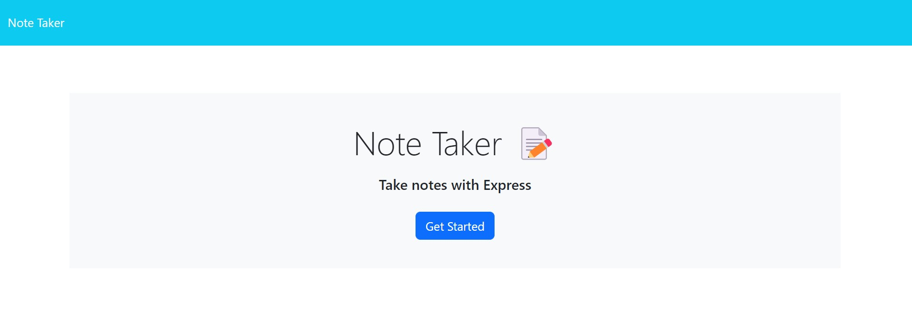
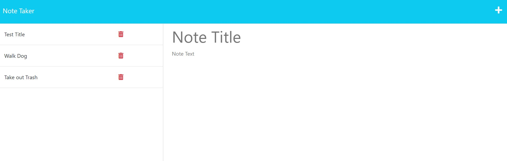

# 11-Note-Taker

## Description

An application that uses Express.js to manage(write and save) notes for the user. Application is deployed to Heroku.

## Table of Contents

1. [Installation](#installation)
2. [Usage](#usage)
3. [License](#license)
4. [Contribution](#contribution)
5. [Testing](#testing)

## Installation

N/A

## Usage

N/A

## License

None

## Contribution

N/A

## Testing

N/A

## Questions

Email me at [abilivick@gmail.com](mailto:abilivick@gmail.com) or explore more projects at [lailiel](https://www.github.com/lailiel)
